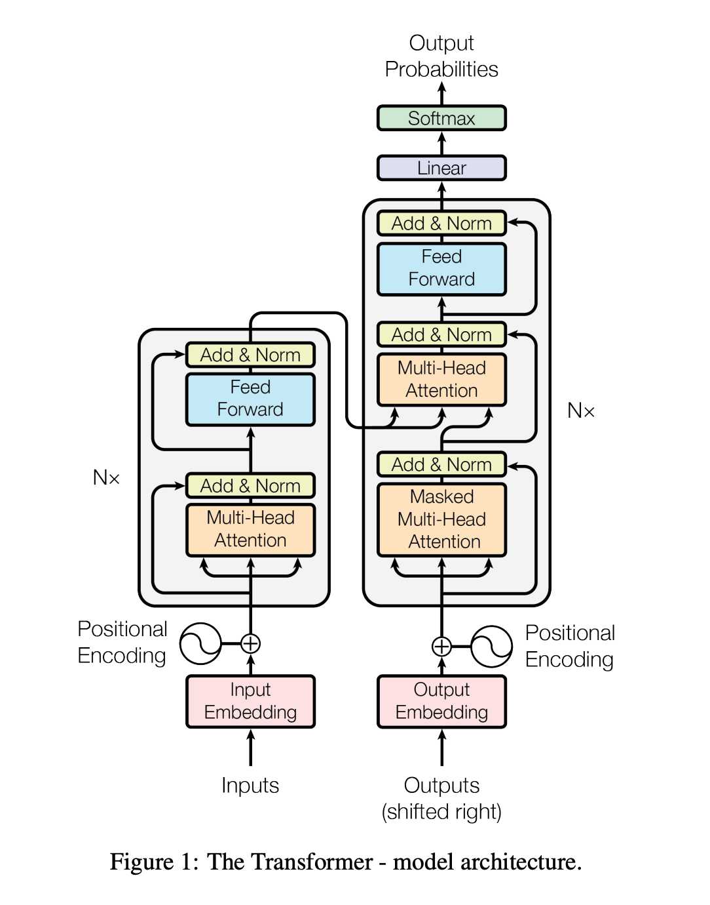

# 🚀 Transformer Translation Model - From Scratch in PyTorch  

  

Welcome to the **Transformer Translation Model** project! This repository is a complete and crisp implementation of the Transformer model from the groundbreaking research paper *"Attention Is All You Need"*, where you can build your own transformer **from scratch** and implement it for translation of text. this project serves as a perfect starting point for anyone for Transformers and machine translation.  

I have used a NLP dataset from huggingface called **OPUS_BOOKS** for implementing the translation. 
Dataset link - https://huggingface.co/datasets/Helsinki-NLP/opus_books/viewer/en-it

---

## 📂 Repository Contents  

### 🔖 Key Files  
- **`Attention-Is-All-You-Need_paper.pdf`**  
  The copy of original research paper that revolutionized natural language processing!  

- **`Transformer_model_arch.png`**  
  A clear and intuitive visual representation of the Transformer architecture, bringing the paper to life.  

### 🔧 Implementation and Utilities  
- **`config.py`**  
  Your one-stop configuration file for all training parameters—epochs, batch size, optimizer settings, and more!  

- **`dataset_tokenizer.py`**  
  A tokenizer built from scratch to handle preprocessing tasks. Dive in and see how raw data gets transformed into model-ready inputs.  

- **`Transformer_model.py`**  
  The heart of the project—a robust PyTorch implementation of the Transformer model, featuring:  
  - Input Embedding  
  - Positional Encoding  
  - Add & Norm Layers  
  - Scaled Dot-Product Self-Attention  
  - Multi-Head Attention Mechanisms  
  - Encoder and Decoder Blocks  

- **`Training.py`**  
  The training framework, equipped with a greedy decoding mechanism for predictions.  

- **`translate_trial.py`**  
  A plug-and-play script to test translations for any input sentence and target language.  

- **`Testing.ipynb`**  
  Test and compare the Beam Search decoder and Greedy decoder for enhanced translation accuracy.  

### 📋 Setup Files  
- **`requirements.txt`**  
  A concise list of dependencies for hassle-free installation. Run:  
  ```bash
  pip install -r requirements.txt
  ```  

- **`LICENSE`**  
  Distributed under the Apache License 2.0—feel free to innovate!  

---

## ✨ Features  

- **Transformer Architecture from Scratch**  
  Understanding of Transformers by building it step by step.  

- **End-to-End Training and Testing**  
  From tokenization to translation, all you need is here!  

- **Greedy and Beam Search Decoding**  
  Experimentation with different decoding methods and their impact on translation quality.  

- **Modular and Extensible**  
  Each component is neatly separated for easy understanding and customization.  

- **Beginner-Friendly Yet Advanced**  
  Whether you're learning or experimenting, this project has you covered.  

---

## 📜 Getting Started  

1. **Clone the Repository**  
   ```bash
   git clone https://github.com/username/transformer-pytorch-translation.git
   cd transformer-pytorch-translation
   ```  

2. **Install Dependencies**  
   ```bash
   pip install -r requirements.txt
   ```  


---

## 📘 References  

- *Attention Is All You Need* - Dive into the foundational research with [this paper](Attention-Is-All-You-Need_paper.pdf).  

---

## 🧑‍💻 Author  

**Karthikeya Valmiki**  

```  

This version adds some excitement while retaining clarity. Let me know if you’d like further refinements!
